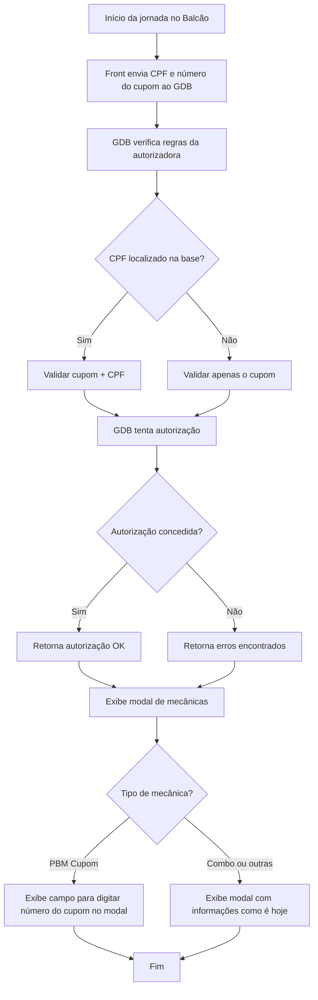

```mermaid
flowchart TD
    A[Início da jornada no Balcão] --> B[Front envia CPF e número do cupom ao GDB]
    B --> C[GDB verifica regras da autorizadora]
    C --> D{CPF localizado na base?}
    
    D -->|Sim| E[Validar cupom + CPF]
    D -->|Não| F[Validar apenas o cupom]

    E --> G[GDB tenta autorização]
    F --> G

    G --> H{Autorização concedida?}
    H -->|Sim| I[Retorna autorização OK]
    H -->|Não| J[Retorna erros encontrados]

    I --> K[Exibe modal de mecânicas]
    J --> K

    K --> L{Tipo de mecânica?}
    L -->|Combo ou outras| M[Exibe modal com informações como é hoje]
    L -->|PBM Cupom| N[Exibe campo para digitar número do cupom no modal]

    N --> O[Fim]
    M --> O
```
