# Sequence Diagrams for SNISB Backend Controllers

## AcompanharBarragemResource

### POST /acompanhar-barragem/salvar

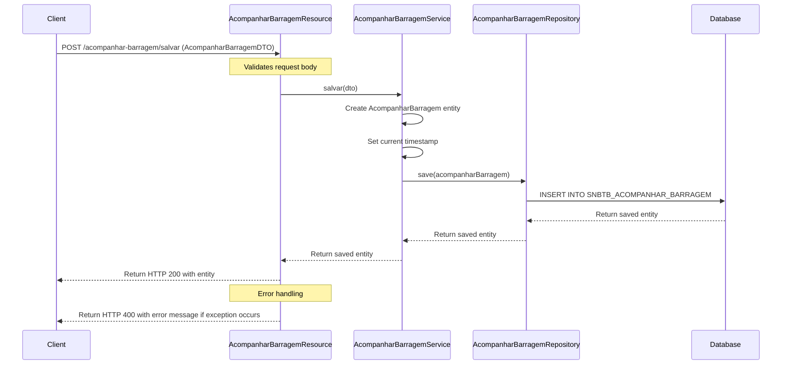

### GET /acompanhar-barragem/excluir/{idBarragem}/{email}

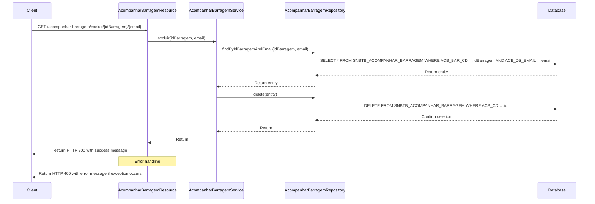

## ArquivoPSBResource

### POST /arquivo-psb/salvar

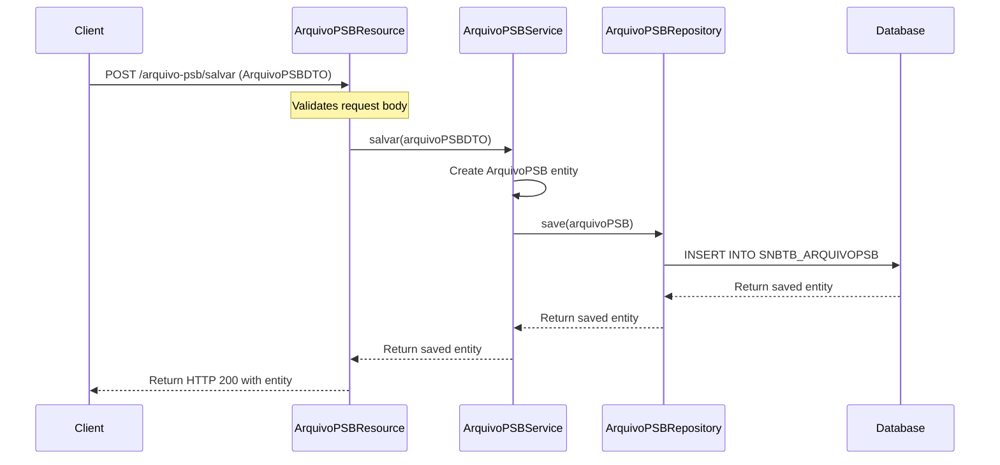

## BarragemAcessoResource

### POST /barragem-acesso/{id}

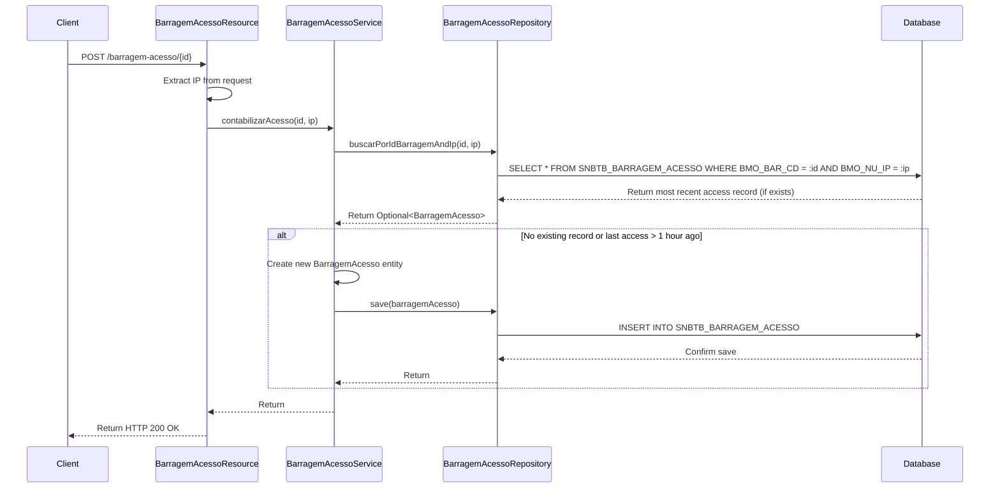

## CapacitacaoResource

### POST /capacitacao/salvar

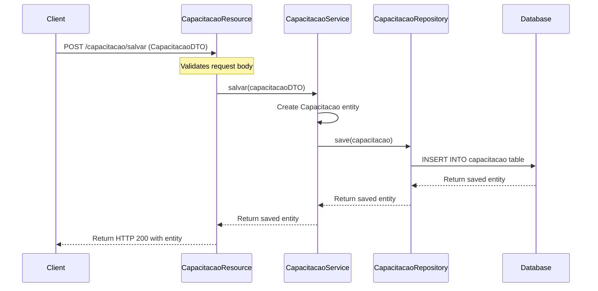

### PUT /capacitacao/alterar

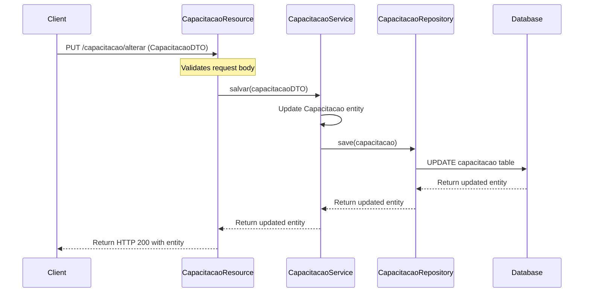

### GET /capacitacao/listarTodos/{idCategoriaCapacitacao}

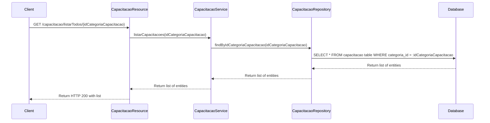

### GET /capacitacao/listar

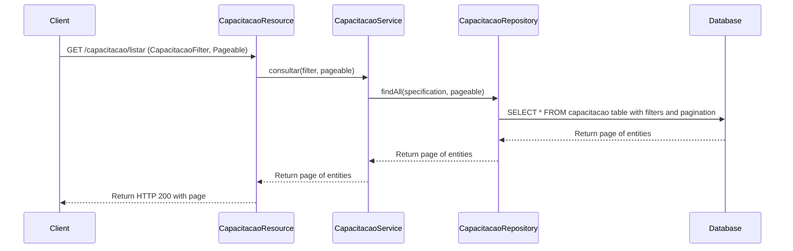

### DELETE /capacitacao/excluir/{idCapacitacao}


## DocumentoSegurancaBarragemResource

### GET /documento-seguranca-barragem/pesquisar

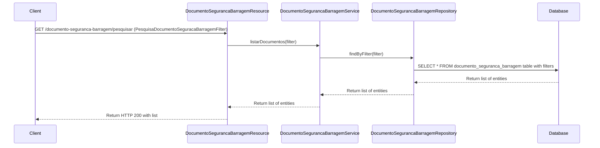

### GET /documento-seguranca-barragem/listar

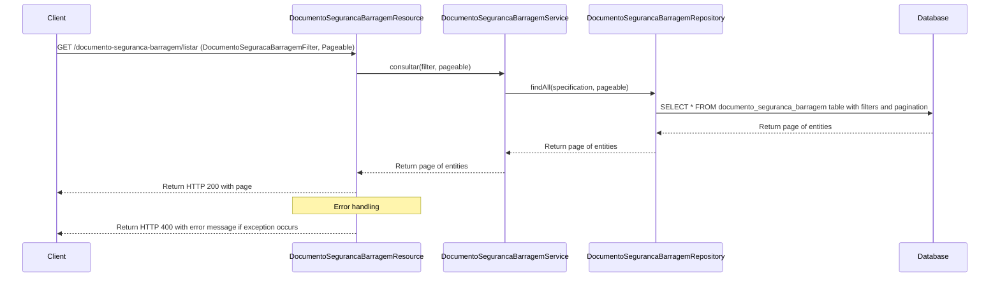

### DELETE /documento-seguranca-barragem/excluir/{idDocumentoBarragem}

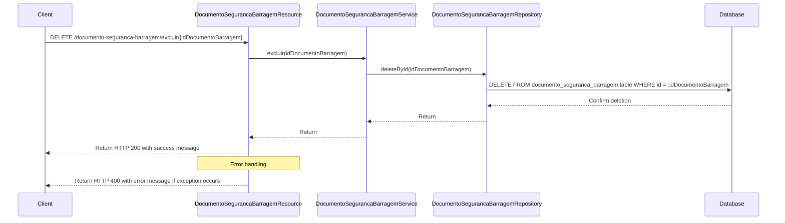

### POST /documento-seguranca-barragem/salvar

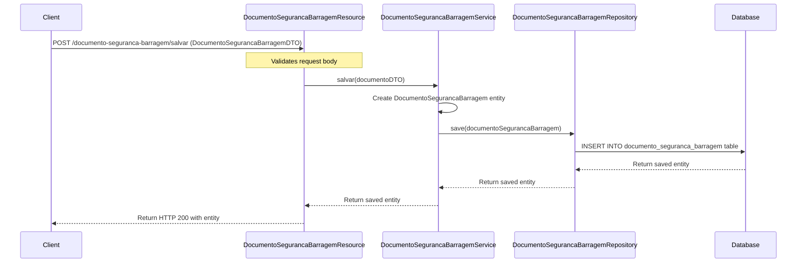

## DominioResource

### GET /dominio/listarTiposMensagem

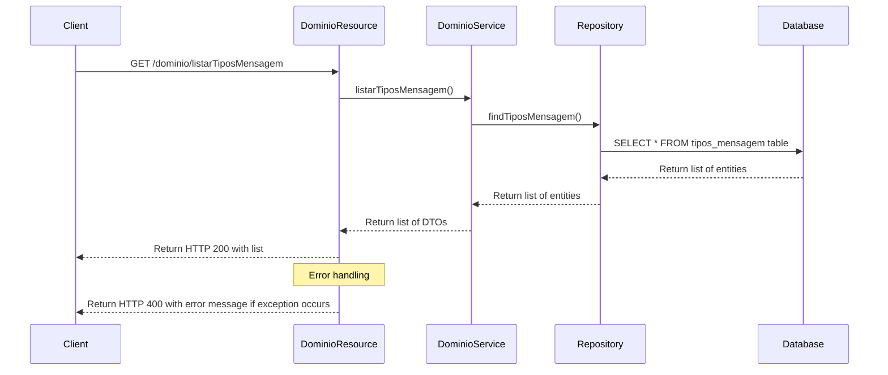

### GET /dominio/listarTiposBarragem

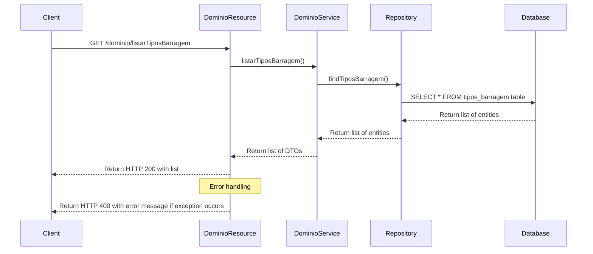

## FaleConoscoResource

### POST /fale-conosco/salvar

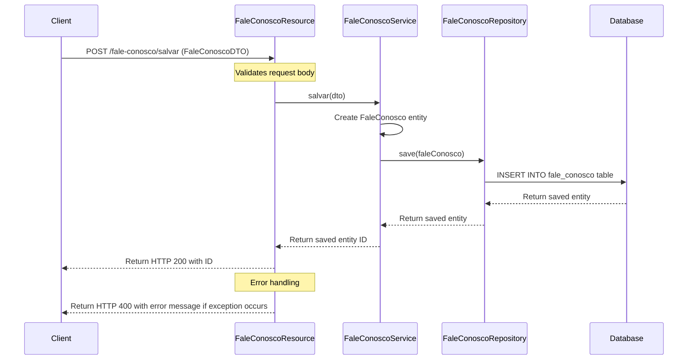

### DELETE /fale-conosco/excluir/{idFaleConosco}

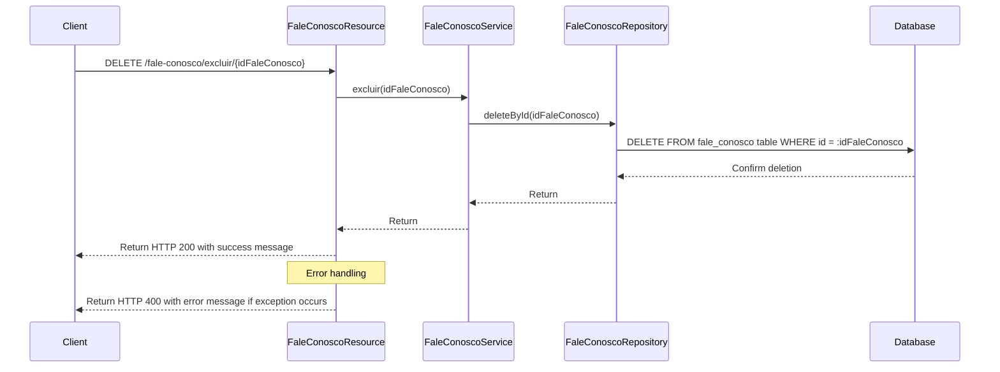

## FileResource

### POST /file/upload/{idEntidade}/{idTipoFormulario}

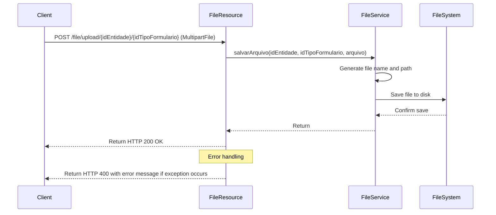

### GET /file/download/{idEntidade}/{idTipoFormulario}/{nomeArquivo}

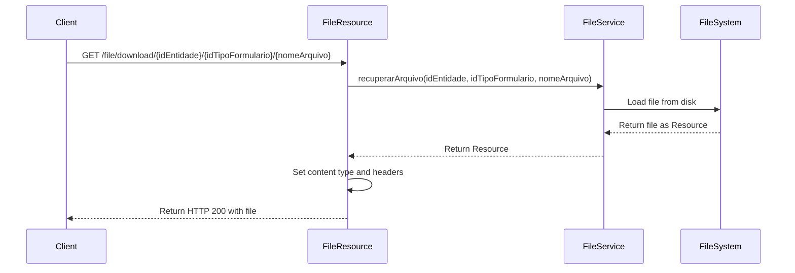

## SecurityResource

### GET /security/currentuser/profiles

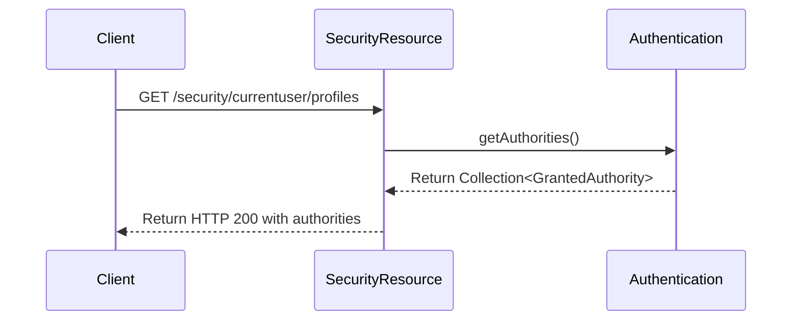

## UserResource

### GET /userinfo

```mermaid
sequenceDiagram
    participant Client
    participant UserResource
    participant Authentication
    participant UserDetails

    Client->>UserResource: GET /userinfo
    UserResource->>Authentication: getPrincipal()
    Authentication-->>UserResource: Return UserDetails
    UserResource->>UserResource: Convert to UserInfoDTO
    UserResource-->>Client: Return HTTP 200 with UserInfoDTO
```

## BarragemResource

### GET /consultar-barragens/buscar-mais-acessadas/

```mermaid
sequenceDiagram
    participant Client
    participant BarragemResource
    participant BarragemService
    participant Repository
    participant Database

    Client->>BarragemResource: GET /consultar-barragens/buscar-mais-acessadas/
    BarragemResource->>BarragemService: buscarMaisAcessadas()
    BarragemService->>Repository: findMostAccessed()
    Repository->>Database: SELECT * FROM barragem_acesso with aggregation
    Database-->>Repository: Return list of results
    Repository-->>BarragemService: Return list of results
    BarragemService-->>BarragemResource: Return list of MaisAcessosDTO
    BarragemResource-->>Client: Return HTTP 200 with list
```

### GET /consultar-barragens/detalhe-barragem/{id}

```mermaid
sequenceDiagram
    participant Client
    participant BarragemResource
    participant BarragemService
    participant Repository
    participant Database

    Client->>BarragemResource: GET /consultar-barragens/detalhe-barragem/{id}
    BarragemResource->>BarragemResource: Extract IP from request
    BarragemResource->>BarragemService: buscarDetalheDTO(id, ip)
    BarragemService->>Repository: findById(id)
    Repository->>Database: SELECT * FROM barragem WHERE id = :id
    Database-->>Repository: Return entity
    Repository-->>BarragemService: Return entity
    BarragemService->>BarragemService: Convert to BarragemDetalheDTO
    BarragemService-->>BarragemResource: Return BarragemDetalheDTO
    BarragemResource-->>Client: Return HTTP 200 with DTO
```
